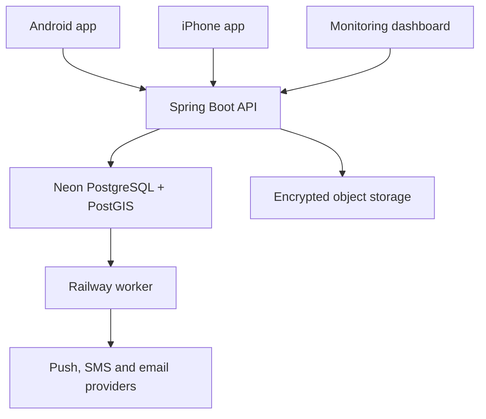
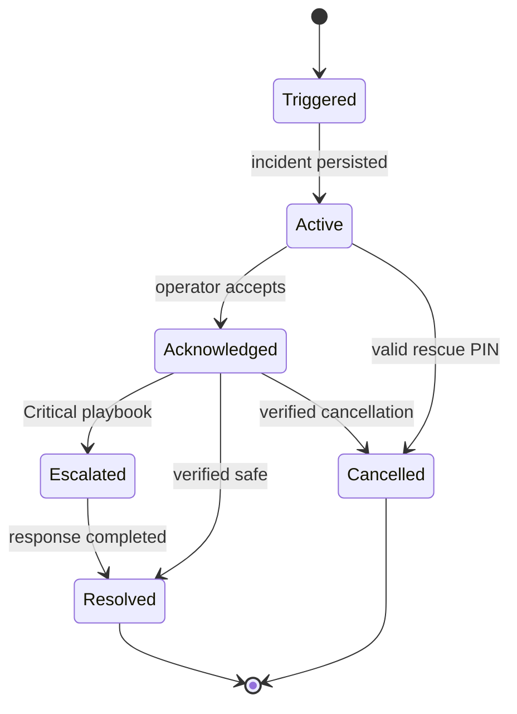

# Stage 6 — Architecture Design

Status: Founder-approved architecture baseline; 2026-10-07 family/contact/deletion updates pending review
Date: 2026-10-07

## Scope, assumptions and non-goals

- This is a logical architecture for version 1 and the controlled pilot, not a claim of proven capacity, availability or rescue capability.
- Version 1 excludes USSD and partner-initiated incidents; USSD remains paused under its tag.
- Railway and Neon are approved low-cost development/controlled-pilot choices, not presumed live-critical-service infrastructure until their recovery and availability are verified.
- GPS may be calculated without internet, but a phone cannot send new evidence when all communication paths are unavailable. The app must show this distinction plainly.
- Provider choices, exact service targets, child-consent rules and production recovery targets remain explicit decisions, not assumptions.

## Architecture style

Use a modular monolith with separate deployable processes for the API and background worker. Mobile applications remain native. The monitoring dashboard is a separate web application. PostgreSQL/PostGIS is the system of record.

## Deployable components

| Component | Responsibility | Initial runtime |
|---|---|---|
| Android app | Native safety UI, background location, offline queue, SOS audio and device permissions | Kotlin/Android |
| iPhone app | Native safety UI, background location, offline queue, SOS audio and device permissions | Swift/iOS |
| API service | Authentication, authorization, commands, queries, validation and OpenAPI | Railway |
| Worker service | Outbox processing, alerts, retries, check-in deadlines, retention and provider callbacks | Railway |
| Admin dashboard | Incident queue and operator workflow, plus platform settings, subscriptions, retention, user/family administration and audits | Railway |
| Primary database | Transactional records, geospatial data, audit references and outbox | Neon PostgreSQL/PostGIS |
| Object storage | Encrypted audio and controlled evidence | S3-compatible provider selected before audio slice |
| Provider adapters | Push, SMS, email, maps, payments and later partner callbacks | Replaceable integrations |

## Backend modules

1. Identity and access
2. Profiles and trusted-circle membership
3. Families, guardian relationships and consent
4. Continuous monitoring settings
5. Trips, check-ins and scheduling
6. Incidents and SOS lifecycle
7. Location and freshness classification
8. Notification delivery and acknowledgement
9. Audio and evidence
10. Operator workflow and escalation
11. Subscription catalogue and entitlements
12. Audit and retention
13. Partner API, disabled until its approved phase

Modules communicate through explicit application interfaces and domain events. They may share one database server but own their tables and migration boundaries. Cross-module table writes are prohibited.

Each deployed process uses its own restricted database role. The runtime role cannot perform schema migrations or bypass authorization policy. A separate migration role is available only to the controlled deployment job.

## Critical incident flow

The incident and its initial outbox records are created in one database transaction. The client generates and persists an idempotency key with the offline event; retries reuse it. A uniqueness constraint scopes the key to the authenticated principal and event type. The API returns the existing incident for an exact retry and rejects key reuse with a different payload. Practice incidents use the same mechanics but carry a mandatory practice classification that cannot be changed to live after creation. Local uses synthetic test data; Pilot keeps practice and live incidents explicitly separated in storage, permissions, dashboards and provider-routing rules.

Alert and callback delivery is **at least once**, not exactly once. The system creates one logical delivery per incident/recipient/channel and enforces a uniqueness key internally. Every provider attempt has a stable delivery ID, attempt count, timestamps and outcome. Adapters reuse provider idempotency keys where supported. After an ambiguous timeout, the adapter checks status where possible before retrying; if the provider has no query/idempotency support, a duplicate may still occur and must be surfaced/audited, not hidden. Transient failures use bounded exponential backoff with jitter; exhausted work enters an operator-visible failed/dead-letter state with safe manual redrive. Provider acceptance is not proof that a person received or read the alert.

Incident state changes use optimistic versioning or conditional transitions to prevent simultaneous operator actions from overwriting one another. State and audit event are committed atomically. External calls occur only after commit through the outbox.

## Offline and degraded-connectivity flow

1. Mobile app captures trigger, device wall-clock time, monotonic elapsed time where available, best available location and provenance.
2. The event is encrypted and stored in a bounded local queue.
3. The app attempts supported data transport and records failure locally.
4. Retry uses the same idempotency key.
5. The server preserves original capture time separately from receipt time.
6. The dashboard labels current, recent, stale, historical, estimated and unavailable location states.
7. Server receipt time is authoritative for receipt; device time is retained as untrusted evidence and may be skewed.
8. No-network operation never claims that unsent evidence reached the monitoring team. A route-reconstructed map point is labelled estimated, not a current fix.

Local queue entries are encrypted with platform-protected keys, size- and age-bounded, and deleted according to retention policy after confirmed sync. SOS metadata is prioritized over audio upload. Full-disk, revoked-permission and key-loss behavior must fail safely and be tested.

## Data ownership and storage

- PostgreSQL is authoritative for identity, consent, trips, incidents, delivery state, subscriptions and audit metadata.
- PostGIS stores location points and enables distance and geographic queries.
- The transactional outbox stores pending asynchronous work in PostgreSQL.
- The worker claims jobs with database locking, retries safely and records each attempt.
- Outbox rows have a unique event/delivery key, available-at time, lease owner/expiry, attempt count and terminal outcome. Workers claim bounded batches using short transactions/`SKIP LOCKED`, then call providers outside the transaction.
- Expired worker leases are reclaimed after a crash. Job handlers are idempotent; poison jobs are quarantined rather than blocking unrelated alerts.
- Database connection pools and worker concurrency are capped below Neon plan limits; backpressure protects the database during alert bursts.
- Audio binaries remain outside PostgreSQL; the database stores encrypted object references, hashes, authorization and retention metadata.
- Precise location and audio have separate access policies from ordinary profile data. Location history uses retention-aware partitions or bounded deletion batches to avoid locking the active incident path.
- Retention defaults to 60 days, is configurable only within legally approved bounds, is versioned/audited, and supports legal holds and verified deletion from database, object storage and derived copies.
- Redis is not required initially and cannot become the source of truth.

## Security boundaries

- Mobile and dashboard clients never connect directly to PostgreSQL or object storage with unrestricted credentials.
- The API enforces user, family-head, operator, supervisor, administrator and partner permissions.
- Authentication and recovery use verified account channels, short-lived access credentials and revocable device sessions. Operator and administrator access requires MFA; privileged actions use step-up verification where appropriate.
- Authorization is checked server-side on every object access, including incident IDs and signed object URLs; identifiers are never treated as permission.
- Rescue PINs are stored only as salted, slow password hashes; comparison is constant-time, attempts are rate-limited, recovery is audited, and PIN values never enter logs or analytics. Duress-PIN behavior remains unresolved and is not silently invented.
- Minor membership requires verified guardian authority and approved consent policy before activation; SMS/email invitation links are short-lived, single-use and bound to the intended invite.
- Trusted-circle members are endpoint-based and do not need app accounts or acceptance. Non-platform members receive SOS-only SMS; the add notice and SOS SMS include a signup link until they join. Existing platform members receive no signup link. Joining through the link with invited identity verification automatically links the account to that owner's trusted circle. This never grants routine location sharing or location-query access.
- Family invitations require platform accounts; a new invitee signs up through the link and is added after completing onboarding with the invited identity verified. A user may head multiple families. Account deletion immediately revokes sessions and family memberships. If the deleted user heads a family, dissolve it, stop its monitoring/tracking, and notify its members by SMS and email; do not notify trusted-circle members. Retain active incidents and other records according to the record-class retention policy configured in the admin dashboard/backend and applicable holds/law. A deleted family head does not disable other members' personal SOS capability.
- Operator access and incident exports are audited. Audit events are append-only to application roles; corrections create compensating events rather than rewriting history.
- Dashboard sessions use secure HTTP-only same-site cookies, CSRF protection and a restrictive content security policy. Mobile apps contain no shared backend credential.
- Family location tracking requires an active membership and the member's disclosed, revocable consent. The family head selects a member to start tracking; the member is notified, and tracking state/views are audited. On SOS, selected trusted-circle members and relevant family members receive SMS with available coordinates and capture/accuracy context; non-platform trusted members receive a signup link, while platform members do not. The dashboard receives the same incident and location evidence.
- Operator access is scoped to assigned incidents or supervisor duties.
- Pilot secrets use protected Railway/GitHub secret stores. Local development uses a documented, ignored `.env` file populated by the developer; Pilot secrets are never copied into local configuration.
- Logs exclude tokens, rescue PINs, unnecessary coordinates and audio contents.
- Audio operations use short-lived, narrowly scoped signed URLs; object keys are non-guessable and buckets remain private.
- TLS protects network traffic; managed database and object-store encryption at rest are required. Key ownership, rotation and breach procedures must be defined before live data.
- Rate limits and abuse detection cover login/OTP, SOS creation, location queries, PIN attempts, invites and provider callbacks.

## Environment model

| Environment | Purpose | Data rule |
|---|---|---|
| Local | Daily development and automated tests | Synthetic only |
| Pilot | Hosted, integrated pilot for real-device drills and approved monitored incidents | Practice and live incidents are visibly distinguished and cannot be confused; practice uses test routing and cannot trigger real authority escalation |

Local and Pilot use separate Railway services, Neon databases/branches, credentials, provider accounts and data. Pilot practice is a clearly isolated data and workflow mode within Pilot, not a third environment. Pilot live incidents are enabled only after operational release gates pass. Local tools and disposable containers support integration tests; no automated test writes to Pilot live data.

## Check-in scheduling and time correctness

- Check-in deadlines and reminders are durable database records with an absolute UTC due time plus the user's original time zone and intended local time.
- Scheduling is recoverable after worker downtime: restart queries overdue records and processes them idempotently; an in-memory timer is never the only scheduler.
- Time-zone changes, extensions, trip cancellation and concurrent check-ins use conditional state transitions.
- Reminder, grace period and missed-check-in incident creation are separate auditable events. Exact tolerances and admin bounds remain configuration decisions.
- A controllable clock is injected for deterministic scheduler tests.

## Critical path availability and degradation

- API readiness is distinct from process liveness. If incidents cannot be durably persisted with outbox work, the service is not reported ready for SOS traffic.
- Dashboard refresh exposes last successful refresh and connectivity state. Realtime/websocket updates may improve responsiveness later but are not required for correctness.
- If Neon is unreachable, clients retain and retry offline events with an explicit "not yet received by monitoring" state. The server never reports success before durable commit.
- If a notification provider fails, the incident remains active, attempts other approved channels and raises an operator-visible delivery failure.
- Provider outages, database exhaustion and growing outbox lag have runbooks, alerts and named operational ownership.
- A live-pilot gate sets measured RTO/RPO and validates backup restore before real users depend on the service; entry-tier provider status pages alone do not meet this gate.

## Observability and Grafana

- Spring Boot Micrometer and OpenTelemetry shall emit structured metrics, traces and correlation identifiers.
- Incident trigger, durable commit, operator visibility, each provider attempt, acknowledgement and authority action are measured as separate timestamps.
- Dashboards distinguish device capture time, server receipt, provider acceptance/delivery evidence, contact acknowledgement and human operator acknowledgement.
- Grafana shall provide operational dashboards for API health, incident creation, outbox backlog, worker delay, notification failures, location failures and operator acknowledgement time.
- Grafana alerts shall cover service unavailability, growing job backlog, repeated provider failure, database exhaustion and missed critical-processing targets.
- Railway logs may support initial troubleshooting, but critical operational evidence shall not depend only on short provider log retention.
- Logs, metrics and traces shall exclude rescue PINs, tokens, audio contents and unnecessary precise location.
- Start with the Grafana Cloud free tier or local Grafana/Prometheus for development; approve paid retention only when measured usage requires it.

## API documentation and Swagger

- OpenAPI is the source of truth for mobile, dashboard and later partner HTTP contracts.
- Springdoc OpenAPI shall generate the specification and Swagger UI from the Spring Boot implementation.
- CI shall validate the OpenAPI document, detect incompatible contract changes and generate typed clients where approved.
- Swagger UI shall be enabled locally and restricted to authorized technical users in Pilot.
- Pilot Swagger UI shall be disabled by default or restricted to authorized technical users; sensitive examples and credentials are prohibited.
- Versioned OpenAPI artifacts shall be stored with each release.

## CI/CD with GitHub Actions

Pull-request validation shall run before merge:

1. Formatting, linting, static analysis and secret scanning
2. Backend unit and integration tests using disposable PostgreSQL/PostGIS through Testcontainers
3. Database migration compatibility validation using expand/migrate/contract. Destructive schema changes require a later release and explicit data-migration plan.
4. OpenAPI generation and compatibility checks
5. Dashboard unit, accessibility and Playwright smoke tests
6. Android unit, lint and relevant instrumentation tests
7. iOS unit and UI tests on an approved macOS runner or the controlled project Mac
8. Container build and vulnerability scan

Deployment workflow:

- Each approved, tested feature slice may deploy incrementally to Pilot after critical checks pass, with incomplete features disabled by default.
- Pilot deployment requires migration review, a rollback plan and post-deployment smoke tests. Enabling a feature for live monitored users additionally requires manual release approval and operational gates.
- Railway and Neon credentials shall use protected GitHub environments and secrets; Local and Pilot credentials are separate and secrets must never enter repository files or CI logs.
- A failed deployment or smoke test stops promotion. Application rollback is preferred; schema changes remain backward compatible because rolling back code cannot safely reverse a destructive migration.
- To control cost, backend/dashboard/Android jobs use available GitHub-hosted Linux capacity; iOS jobs use the project Mac or budget-approved macOS minutes.

## Incremental delivery

Each vertical slice includes mobile or dashboard UI where applicable, API, OpenAPI/Swagger updates, database migration, worker behavior, tests, Grafana telemetry and CI/CD deployment verification. A slice is deployable only after its acceptance criteria pass. Feature flags protect incomplete or deferred capabilities.

Recommended initial slices:

1. Repository foundation, environments, health checks and deployment pipeline
2. Identity, session security, profile and trusted-contact onboarding
3. Practice SOS end to end, including delivery state and operator acknowledgement
4. Live manual SOS, operator visibility and contact acknowledgement
5. Critical classification, operator alerting and authority-playbook actions
6. Location modes, freshness display and offline synchronization
7. Durable trips/check-ins and recovery after worker downtime
8. Family option with consent and guardian verification
9. Audio, fake call and subscription packages

Each slice starts with acceptance criteria, risk-appropriate threat review, migration, dashboards/alerts, failure tests and rollback notes. Only tested, approved slices are promoted; unfinished features remain disabled by default.

## Scaling and migration triggers

Reassess Railway/Neon when any of these occur:

- Provider availability or recovery does not meet approved live targets.
- Database connection, storage, compute or geographic limits approach agreed thresholds.
- Background-job delay threatens alert or check-in targets.
- Required regional redundancy, support, audit or data-governance controls are unavailable.
- Measured usage makes another platform safer or more economical.

Migration is supported by containerized services, standard PostgreSQL/PostGIS, OpenAPI contracts and S3-compatible object storage.

## Architecture decisions requiring later evidence

- Final SMS, maps, email, payments and object-storage providers.
- Default freshness thresholds and detailed Critical escalation timing.
- Guardian verification and separate duress-PIN behavior.
- Exact supported OS versions and device tiers.
- Live backup, recovery and availability targets.
- Production platform after Railway/Neon limits are measured.

## Stage review

**Correctness:** Matches approved requirements, criticality profile and technology selections.

**Architecture review finding:** The first draft was a solid component outline but not a sufficient high-criticality design. This revision adds explicit delivery semantics, durable scheduling, authentication/authorization, offline queue protections, data lifecycle, failure behavior, environment separation and recovery gates. It remains a logical design; capacity, provider behavior and service targets require prototypes and testing.

**Main risk:** Railway/Neon free or entry tiers are appropriate for development and controlled validation, not an unverified claim of 24-hour live safety availability.

**Approval:** Founder approved this architecture baseline on 2026-10-07. It authorizes the next design stages and implementation planning; it does not certify production readiness, measured scale, or 24-hour operational coverage.
