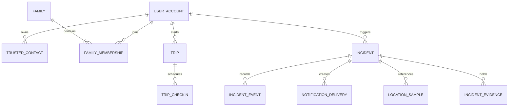

# Stage 8 — Database Design

Status: Logical design approved; initial Flyway migration draft added on 2026-10-07 and awaits PostgreSQL/PostGIS execution validation  
Date: 2026-10-07  
Database: PostgreSQL + PostGIS  
Scope: Version 1 and controlled Pilot; USSD and partner-initiated incidents are deferred

## 1. Purpose and design boundaries

This is the logical data model and migration approach for the approved modular monolith. It is not executable DDL and does not claim measured scale. Physical indexes, partitioning, connection limits and retention jobs must be validated against representative data before live use.

PostgreSQL is the system of record. PostGIS supports location queries. Audio bytes live in private encrypted object storage; PostgreSQL stores only their metadata and access/retention references. No client connects directly to the database.

The deployment has two environments: Local and Pilot. They use separate databases, credentials and provider configuration. Pilot practice and live incidents share the Pilot environment but are isolated by immutable incident mode, authorization, dashboard presentation and notification routing.

## 2. Design principles

- Give each module ownership of its tables and migrations. Other modules use application interfaces or domain events, not direct writes into another module's tables.
- Use UUID primary keys, UTC `timestamptz` instants, explicit status values and foreign keys for durable relationships. Phone numbers and email addresses are attributes, never primary keys.
- Keep current operational state separate from append-only history where the history is needed for audit, response timelines or retries.
- Store only the data needed for the product purpose. Apply field-level access controls to precise location, audio references, contact details, rescue-PIN hashes and operator notes.
- Use database constraints for uniqueness and referential invariants. Use transactions for coupled changes.
- Do not store raw PINs, passwords, provider credentials or full audio content in PostgreSQL.

## 3. Logical entity groups and ownership

| Module owner | Core tables/entities | Purpose and important fields |
|---|---|---|
| Identity | `user_account`, `user_identifier`, `device_session`, `registered_device` | User lifecycle; normalized phone/email and verification state; revocable sessions; device/platform metadata and push-token reference. Authentication-provider details remain replaceable. |
| Consent and preferences | `consent_record`, `user_safety_settings`, `location_sharing_policy`, `sharing_recipient` | Append-only consent/grant/revocation history; monitoring preferences; sharing mode, allowed frequency preset, recipient links and effective dates. |
| Trusted contacts | `trusted_circle`, `trusted_circle_member`, `contact_join_link`, `contact_notification_delivery` | Owner's trusted circle and endpoint-based members; no platform account or acceptance required. Records optional linked `user_id`, normalized phone/email, active state and SOS-only eligibility. Add notices and SOS messages include signup links for non-members only; verified join through a link attaches the account to that owner's circle. A valid phone is required for SOS SMS. |
| Family | `family`, `family_membership`, `family_invitation`, `family_member_tracking`, `family_location_permission`, `family_location_access_event` | Platform-account membership; invite state including signup pending; consent and revocation; head-selected tracking state; every location view/refresh and result. A user may head multiple families. Guardian verification remains a controlled status until its policy is approved. |
| Trips, check-ins and fake calls | `trip`, `trip_checkin`, `checkin_policy_snapshot`, `fake_call_schedule` | Trip state, destination/arrival details if supplied, timezone, due time in UTC, original local time, reminder/grace settings snapshot, confirmation/trigger state, and scheduled fake-call status. |
| Incidents | `incident`, `incident_event`, `incident_assignment`, `incident_note`, `incident_contact_attempt` | Incident trigger/source, immutable `practice` or `live` mode, severity, state/version, assigned operator, response timeline, notes and contact attempts. |
| Location | `location_sample`, `user_location_current` | Historical coordinates with capture/receipt times, source and accuracy; optional current-location projection for fast permitted reads. Freshness is evaluated from capture time and configured mode thresholds, not treated as a permanent property of a point. |
| Notification delivery | `incident_recipient`, `incident_recipient_reason`, `notification_delivery`, `notification_attempt`, `provider_callback`, `contact_notification_delivery`, `account_deletion_notification` | Logical alert per incident and resolved recipient/channel, including account-less trusted-circle members; SMS/email delivery to family members when a family is dissolved; attempt history; provider acceptance, delivery evidence, acknowledgement, failure and unknown states. Recipient snapshots preserve all qualifying relationships and whether a signup link was included. |
| Worker/outbox | `outbox_event`, `idempotency_record` | Durable asynchronous work and repeat-safe client/provider requests. Outbox payloads reference records and avoid unnecessary sensitive location data. |
| Evidence | `incident_evidence` | Object key, media type, size, hash, capture/upload state, retention deadline, authorization and deletion state. Binary audio stays outside PostgreSQL. |
| Operations and admin console | `operator_profile`, `admin_profile`, `incident_audit_event`, `system_audit_event`, `configuration_version`, `retention_policy_version`, `account_deletion_event`, `legal_hold` | Operator/admin roles; append-only action and access history; versioned, audited settings; deletion decisions and evidence holds. The web admin console supports monitoring and broader administration/configuration. |
| Subscriptions | `subscription_package`, `package_version`, `package_entitlement`, `user_subscription` | Configurable package catalogue, immutable package version and effective entitlement snapshot per subscription. Payment provider records are added when a provider is selected. |

Trusted contacts are endpoint-based records and do not require `user_account` rows. Existing platform members do not receive signup links. A non-member joining from the notification link is associated only after signup and verification of the invited identifier; this grants trusted-circle membership and SOS alerts, not routine location sharing. Family members do require platform accounts. A family head may own multiple `family` rows; do not impose a unique constraint on `family.head_user_id`. Partner organizations, partner credentials/callback subscriptions and USSD-originated incidents are intentionally excluded from the version 1 schema. Add them in their approved phase with independent consent, tenant isolation, idempotency and audit review.

## 4. Core relationships

The diagram is simplified. A location sample may be linked to a user, trip and/or incident according to its capture context. Access is determined by current permission and purpose, not by the presence of a foreign key.

## 5. Safety-critical constraints and transaction boundaries

1. **SOS/idempotency:** A request key is unique for its authenticated principal and operation. Store a canonical request hash and the resulting incident reference. A retry with the same hash returns the original incident; reusing the key with different content is rejected and audited. A genuinely new user activation uses a new key and must not be merged with an earlier incident.
2. **Incident creation:** Insert the incident, initial state event, selected notification-delivery rows and outbox work in one database transaction. Do not call SMS/push providers inside this transaction.
3. **Incident state:** Keep current state and version on `incident`; append every valid transition to `incident_event` in the same transaction. Use a conditional update/version check so concurrent operator actions cannot silently overwrite one another.
4. **Practice isolation:** `incident.mode` is required and immutable after creation. Provider routing checks it on the server: practice cannot contact real authorities. Dashboard and audit queries must filter and label it explicitly.
5. **Check-in scheduler:** Each check-in has a unique trip-local sequence or stable ID, `due_at_utc`, original timezone/local time, grace deadline and state. A conditional state transition claims it once; missed-check-in incident creation and outbox work are idempotent and transactional.
6. **Family permission:** Family invitation acceptance includes a clear, recorded grant for routine family location visibility. Current member settings determine which locations are available; revocation immediately denies non-SOS views/refresh requests. An explicit SOS uses the separate SOS-only sharing mode and sends its incident location to configured circle recipients. Record requester, consent version, request time, result state and location sample returned; never make the history a route to retrieve a later location. SOS creation snapshots eligible recipients and relationship reasons for the dashboard and SMS renderer.
7. **Family tracking selection:** Only a family head can select an active joined member to start tracking. Verify the member's recorded consent and active location mode before every location read; record selection/start/stop, notify the member, and apply revocation immediately.
8. **Trusted-circle membership:** Adding a non-platform member activates SOS-only SMS routing without acceptance. The notice and SOS message include a join link until the person joins; existing platform users do not receive signup links. Join-link signup verifies the invited identifier before attaching the account and notifies the circle owner. Account linkage must never silently grant routine sharing or location-query rights.
9. **Invitation/link security:** Store only a hash of each join token, enforce expiry, scope and replay protection, and bind family signup to the invited phone/email after verification. Configure link lifetime and resend policy in the admin dashboard/backend. A public response must not reveal whether an account exists.
10. **Notification delivery and recipient deduplication:** Send one SMS per resolved person per incident, even when eligible through multiple families and/or a trusted circle. Resolve registered recipients by account ID and account-less recipients by normalized verified phone endpoint. Create one logical delivery for each incident, resolved recipient and channel; preserve every qualifying family/trusted-circle relationship as an associated reason in the recipient snapshot/audit trail. Provider retry attempts do not create additional logical alerts. Provider callback IDs are unique within provider scope and callbacks are signature-checked before persistence.
11. **Outbox processing:** Claim bounded batches with a short lease transaction; call providers outside the database transaction. Leases expire after worker failure. Poison events are marked terminal/dead-letter for operator review and safe redrive.
12. **Account deletion and retention:** Deletion immediately revokes sessions and removes the user from family membership. If the deleted account heads a family, dissolve that family, stop its monitoring/tracking, and notify its members by SMS and email using available verified endpoints. Do not notify trusted-circle members. Preserve active incidents and other records until their configured retention deadlines, except legal holds. Remaining users' personal SOS features remain active. The admin dashboard shall configure and audit retention durations by approved record class; store the policy version and `retain_until` with affected records. Changes apply prospectively unless an authorized migration explicitly updates existing deadlines.
13. **Audit:** Commit important state changes and their audit events together. Application roles may append audit events but cannot edit or delete prior events; corrections are additional events.
14. **Rescue PIN:** Store only a salted, slow hash and failure/lockout metadata. Keep the hash out of normal user projections, logs, analytics and exports. Exact hashing parameters and recovery procedure are implementation security decisions reviewed before the cancellation feature ships.

## 6. Indexing and geospatial access

Initial indexes should support demonstrated query paths, then be checked with `EXPLAIN (ANALYZE, BUFFERS)` on representative volumes:

- Unique lookup indexes for verified user identifiers and scoped idempotency keys.
- Incident queue indexes by immutable mode, state/severity, creation time and assignment; avoid one broad unbounded dashboard query.
- Partial index for pending check-ins by `due_at_utc`; pending outbox work by `available_at` and lease expiry.
- Notification deliveries by incident/status and provider callback identity; attempts by delivery/time.
- Family membership/permission lookups by family, member and active status; invitation lookups by token hash and expiry.
- Location samples by user and capture time, plus a PostGIS GiST index for the geographic query paths actually approved.
- Evidence by incident and retention/deletion state; audit by target and time.

Store a point using an explicit spatial reference and preserve reported accuracy separately. Enforce bounded time windows and result counts for location-history queries. Do not add a geospatial index to every table by default.

## 7. Retention, deletion and partitioning

- Use 60 days as the initial default for incident, location, audio and operator evidence. An authorized administrator shall configure retention durations by record class in the admin dashboard/backend, within approved legal and operational bounds. Keep required account/billing/audit data for its separately configured retention period.
- Store `retain_until` or an equivalent computed retention deadline for evidence records; version and audit admin policy changes. A hold pauses deletion and is itself access-controlled/audited.
- Deletion jobs must be resumable and bounded. Record each object deletion outcome and do not mark an incident's evidence deleted until the database and object-store outcomes are reconciled.
- Location samples are the highest-volume sensitive table. The proposed physical strategy is time-based partitioning with retention-aligned partitions if measured pilot volume and Neon/PostgreSQL capabilities support it; otherwise use bounded indexed deletion. Do not partition every table prematurely.
- Before enabling partitioning, validate unique-key/foreign-key design, migration behavior, query plans, retention jobs and restore procedures with production-like data.
- Keep object keys private and non-guessable. Deletion includes object versions/replicas and derived exports where supported by the selected provider.

## 8. Environment and access model

The admin dashboard is the team's administrative application, not a monitoring-only screen. It hosts the incident-monitoring workflow and broader administration, including settings, subscription packages, configurable retention, user/family administration and audit review. Configuration writes use versioned records, role-based authorization and audit events; mobile clients do not access admin configuration tables directly.

- Local and Pilot have separate database instances/branches, credentials and synthetic/live provider settings. Automated tests use disposable Local databases only.
- Pilot stores both practice and approved live records; immutable mode, role checks, scoped queries, distinct dashboard views and test/live provider routes are mandatory.
- API and worker runtime roles use least privilege. Migration credentials are separate and available only to the deployment migration job. Dashboard and mobile clients never receive database credentials.
- PostgreSQL permissions are defense in depth; application-level authorization remains mandatory for every object. Evaluate row-level security only where it can be consistently enforced and tested without weakening the module boundaries.
- Encrypt database connections and use managed encryption at rest. Key ownership, rotation and any application-level encryption for particularly sensitive fields must be settled before live data; geospatial queries may constrain field encryption choices.

## 9. Migration and verification approach

- Use Flyway Community with SQL versioned migrations. PostgreSQL-specific SQL keeps the PostGIS schema explicit; Local pins the Flyway CLI version in `database/compose.yaml`. The Spring Boot service must later pin the compatible Flyway PostgreSQL module and JDBC driver as application dependencies.
- Keep each migration small, ordered and reviewable. Never edit a migration already applied to Pilot; add a corrective migration.
- Use expand/migrate/contract for changes that need compatibility with the currently deployed Pilot version. Destructive changes require a separate release and a verified backup/restore plan.
- CI validates migrations from an empty database and from the previous released schema, then runs integration tests against disposable PostgreSQL/PostGIS.
- Before Pilot deployment, back up as required, inspect migration locks/runtime, apply through the restricted job, verify health and smoke-test critical queries. Document forward repair; do not rely on automatic rollback of destructive data changes.
- Validate constraints, concurrency, idempotency, outbox recovery, check-in scheduler recovery, authorization, retention deletion and representative query plans before live pilot entry.

## 10. Founder decision status

All eight decisions below have been answered and are closed. “Configurable” means an authorized administrator changes the value in the admin dashboard/backend; each change is versioned and audited.

| # | Decision | Status | Recorded design |
|---|---|---|---|
| 1 | Authentication identity | **Approved** | An account may have verified phone and email identifiers; each is unique once verified. Authentication provider selection is a repository-foundation implementation choice. |
| 2 | Family cardinality | **Approved** | A user may join and head multiple family circles. Enforce one membership per user/family pair; do not make the family head unique across families. |
| 3 | Trusted-contact representation | **Approved — updated flow** | Trusted members may be added without an account or acceptance and receive SOS-only SMS. Non-members get signup links in add notices and SOS alerts; joining via a verified link auto-links them. Existing platform users get no signup link. Family membership remains account-based and follows its separate accept/signup flow. |
| 4 | Location sharing policy | **Approved — configurable** | Version each policy and grant. Admin settings define allowed location-frequency bounds and freshness thresholds; users choose within the allowed bounds. Revocation immediately blocks routine reads. |
| 5 | Location storage volume | **Approved — configurable** | Location retention duration is configurable by record class through the admin dashboard/backend. Use 60 days as the initial default, subject to legal/operational bounds. Partition only when Pilot evidence justifies it. |
| 6 | Audit and identity retention | **Approved — configurable** | Retention periods for identity, subscription, audit and other records are configurable and versioned in the admin dashboard/backend, within applicable legal/accounting requirements. |
| 7 | Operator notes | **Approved** | Notes are text-only, append-only and access-controlled. Corrections use a new note/event; retention follows the configured incident evidence policy. Attachments are excluded from version 1. |
| 8 | Account deletion and relationships | **Approved — configurable retention** | Delete family membership. If the deleted user heads a family, dissolve that family, stop its monitoring/tracking and notify members by SMS and email. Do not notify trusted-circle members. Record retention and legal holds are administered through the dashboard/backend. |

**Additional confirmed decision:** Send one SMS per resolved person per incident, even when they qualify through multiple family circles and/or a trusted circle. Preserve all relationship reasons in the incident recipient snapshot and audit data (see safety-critical constraint 10).

## Stage review

**Scope:** The logical design is approved. The initial executable schema draft is at `database/migrations/V1__initial_schema.sql`, with a Local runner in `database/compose.yaml`. No database has been created or migrated in this workspace. PostgreSQL/PostGIS execution validation is still required.

**Risk findings:** Highest risks are unauthorized cross-user location access, practice/live routing mistakes, duplicate or missed SOS work, and unsafe deletion/retention behavior. The constraints above require tests before implementation is considered complete.

**Decision gate:** Founder product decisions are resolved, including one SMS per person per incident (see constraint 10). The executable migration is an implementation draft and is not validated until it successfully applies to a disposable PostgreSQL/PostGIS database and passes schema checks.
